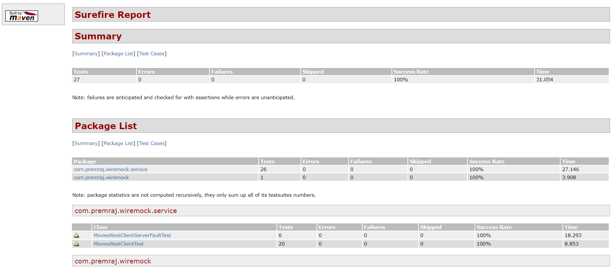

# WireMock
To demonstrate WireMock capabilities in testing the API services. 

### Service Virtualization using WireMock

## Stack

| Category     | Value                          |
|--------------|--------------------------------|
| Language     | Java                           |
 | Mock Library | WireMock                       |
 | Rest Client  | WebClient                      |
| Build Tool   | Maven                          |
| Test Tool    | JUNIT5                         |  
| framework    | Spring Boot                    |
| Report       | Maven Surefire Report Plugin   | 


## Objective

* Simulating an external service 
* Simulating latency
* Simulating error response
* Simulating network errors

## features
* WireMockExtension is for JUnit5 and SpringBoot to support WireMock.
* ConfigureWireMock to enable embedded wiremock server.
* Stub gets added to wiremock server and client can interact with server.
* Response Template Transformer to generate dynamic http response.
* Verify DSL to ensure rest call os made through client and monitor service hits.


Run tests:
```$xslt
mvn clean test surefire-report:report
```

### Reports
Maven Surefire Report Plugin will generate report all the test run in the execution

Sample screenshot of report for the execution below:

